# 1. Design Systems para Angular (4h)

### O que são design systems?

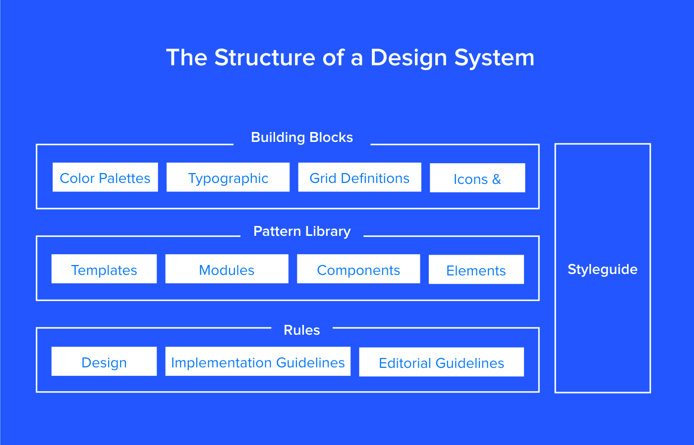

- Building Blocks: components básicos, como paleta de cores, tipografia, ícones, padroes de espacamento, etc.
- Design System
  > é o conjunto completo de padrões do projeto, documentação e princípios, juntamente com o kit de ferramentas de design e código para atingir esses padrões
- Pattern Library
  > é uma subclasse no sistema de design, é o conjunto de padrões de design para uso em uma empresa.
- Style Guide
  > é outra subclasse no sistema de design. Uma documentação que descreve o próprio sistema de design: como os produtos devem parecer e se comportar, padrões de interface do usuário como tamanho de fonte, cores, botões e etc.

Referências:

- https://brasil.uxdesign.cc/entendendo-design-system-f375bbb6f704
- https://xdresources.co/resources/bootstrap-4-ui

### Notas

- Importância da UX para o usuário
- É tudo questão de comunicacão
- Identidade visual, fortalecimento de marca, seguranca, robustez

## 1.1. Templates vs Bibliotecas de UI (20min)

### O que são?

- Bibliotecas: conjunto de componentes, estilos e padrões. Normalmente customizáveis e básicos. Não envolvem telas pré-prontas, apenas componentes isolados.
  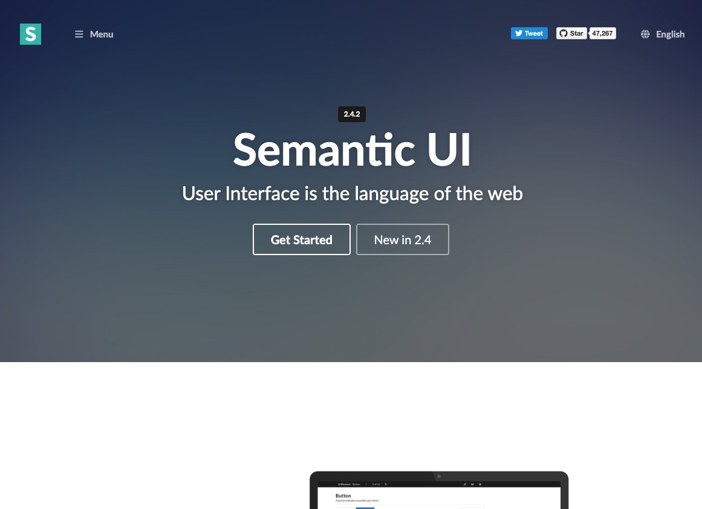
  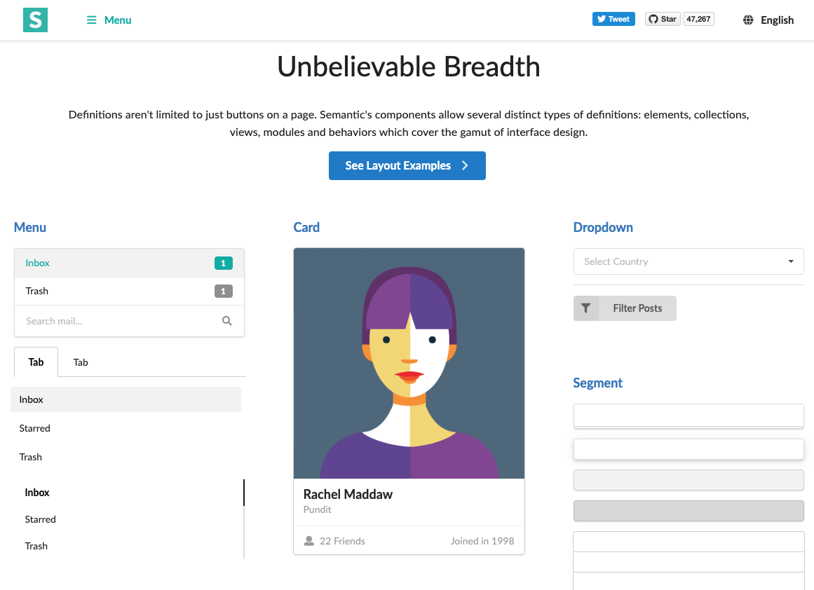
  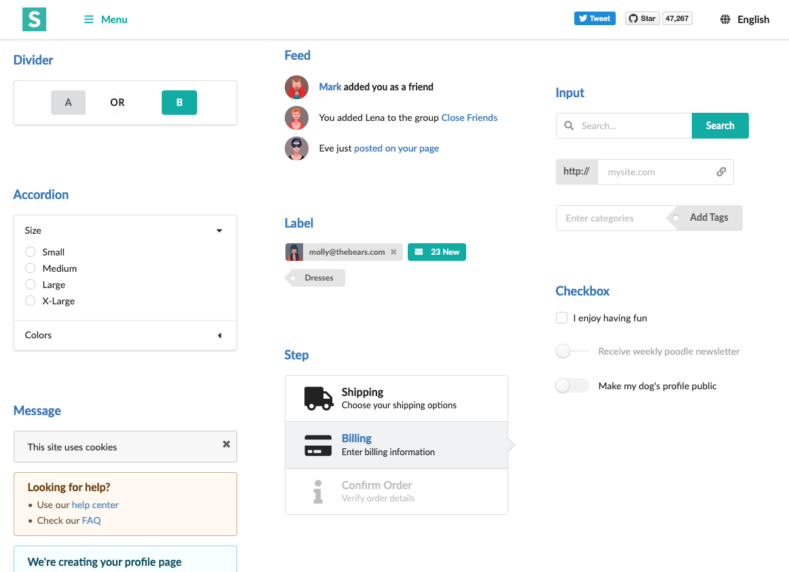
- Templates: comumente feitos em cima de alguma biblioteca. Focam em telas pré-prontas, componentes mais complexos e estilizacão própria. Podem também estar focados em algum nicho de negócio, como e-commerce e dashboards.
  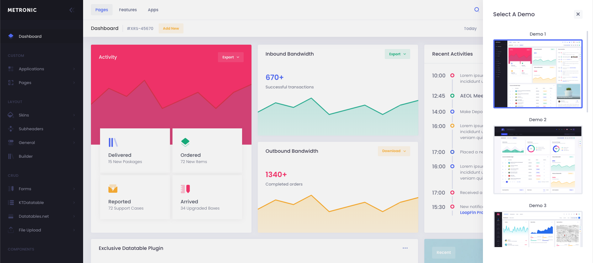
  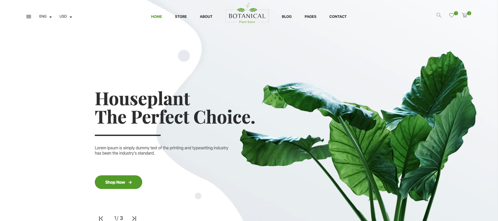
  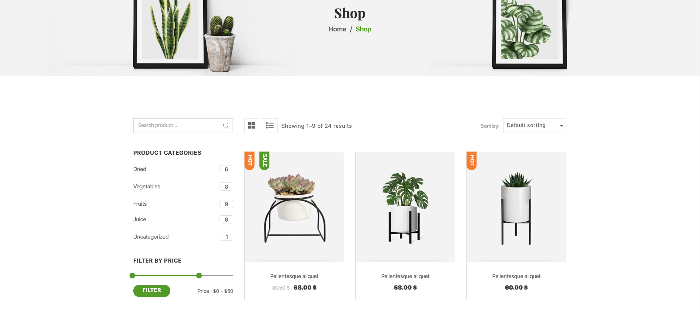

### Eu tu usava isso (ou aquilo)...

Templates vêm mais prontos, mais trabalhados, muitas vezes já aplicados a um contexto específico. Pode cortar um tempo imenso. No entanto, têm sua própria arquitetura, seu próprio jeito de organizar o frontend. Cedo ou tarde o time vai querer (e precisar) ter controle sobre tudo isso. Pode ser importante no início, para botar o bloco na rua sem se preocupar tanto com organizacão do frontend, ao mesmo tempo que se garante uma alta qualidade visual. No entanto, no futuro, para garantir qualidade, será necessário implementar algo em casa mesmo. Nessas horas, customizar uma biblioteca de UI pode ser o equilíbrio perfeito. Num terceiro estágio, é natural o desejo de reduzir dependências e implementar tudo manualmente, para ter controle total.

## 1.2. Feito em casa vs. Dependência (20min)

### Pense bem antes de depender de alguém

- > “Change is the only constant…” – Heraclitus
- O jeito como fazemos tecnologia muda muito rápido
- Muitas das dependências que temos nos nosso código terá mudado bastante nos próximos anos
- Nos agarramos a frameworks, bibliotecas e ferramentas como se não fossem mudar nunca. "Tu conta ou eu conto?"
- Depender de bibliotecas que resolvem coisas básicas presentes em todo de aplicacão é normal (autenticacão, criptografia, http, validacão de forms, etc.)
- É melhor que nós foquemos no céodigo específico à nossa aplicacão, nossas regras de negócio
- Bibliotecas podem mudar drasticamente, serem abandonadas, descontinuadas, não acompanharem as mudancas do contexto,quebrarem, conflitarem com versões de outras bibliotecas ([dependency hell](https://en.wikipedia.org/wiki/Dependency_hell)), etc.

### Pense bem antes de reinventar a roda (tens braco pra resolvar as broncas?)

### Tem hora pra tudo

Adapter pattern 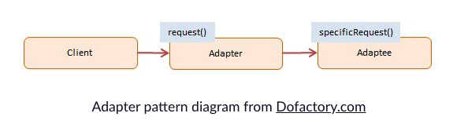
Antes de adicionar uma depenência, se pergunte:

- A biblioteca tende a mudar de uma muito impactante?
- Uma mudanca grande na biblioteca causaria muito dano na sua aplicacão?

O que procurar:

- A biblioteca já está por aí há muitos anos
- Já teve muitas _major releases_
- É utilizada por aplicacões comerciais
- É financiada por uma empresa grande
- Tem uma comunidade ativa
- Estrelas no github? =D

Provavelmente dará certo se:

- Só for usada numa porcão pequena da sua aplicacão
- O código dependente não está tão atrelado às suas regras de negócio
- Pouco esforco seria necessário para removê-la do projeto

_Referência: https://www.freecodecamp.org/news/code-dependencies-are-the-devil-35ed28b556d/_

## 1.3. Opções - https://blog.bitsrc.io/11-angular-component-libraries-you-should-know-in-2018-e9f9c9d544ff (30min)

### Tem muita coisa boa nesse mundo (cuidado com as #fakenews)

### Não se iludir

Escolher uma biblioteca dessas de UI consiste em duas coisas: estilo (css) e componentes (js). A parte do estilo é ok, mas o que pega mesmo é o js. Utilizar os componentes de uma biblioteca dessas é se abracar com uma dependência. É importante ter consciência disso. Uma alternativa seria implementar tudo, não havendo a possibilidade, o ponto de equilíbrio é ir deixando de usar os componentes dessa biblioteca aos poucos até ficar só com a parte do estilo. Depois, implementar um a um os componentes individuais ou incluir bibliotecas robustas e confiáveis específicas.

### Jogando fácil

Pragmaticamente: Bootstrap, NG-Bootstrap e vamo já pensando na transicão e nos próximos passos.

## 1.4. Casos de uso: modal, tooltip, dropdown, select, toast, tabs, WYSIWYG, date picker, calendar, carousel, pagination, progress bar (2h50min)

### Simplificando os conflitos com os designers: é tudo uma questão de custo

1. Exercitar o poder da estimativa
2. Negociar com o designer versões simplificadas quando necessário (algumas vezes, não dá)
3. Prover alternativas e seus custos

### Quando usar cada coisa: pergunta ao designer

# 2. Arquitetura e Padrões (8h)

### Fazer todo mundo faz, todo mundo entrega, todo mundo mantém (por pouco tempo, com poucas pessoas, com pouca complexidade, com poucos usuários, com muitos recursos, etc.)

### Software, entropia, T0

> The second law of thermodynamics, in principle, states that a closed system's disorder cannot be reduced, it can only remain unchanged or increase. A measure of this disorder is entropy. This law also seems plausible for software systems; as a system is modified, its disorder, or entropy, tends to increase. This is known as software entropy. - [Wikipedia](https://en.wikipedia.org/wiki/Software_entropy)

> Software entropy is the risk that changing existing software will result in unexpected problems, unmet objectives, or both.

> It is the invisible hand that breaks component interactions that weren’t in scope, causes production servers to inexplicably crash, and withholds a timely and cost-effective hotfix.

- Expectativas de cumprimento de sprints e ciclos de desenvolvimento
  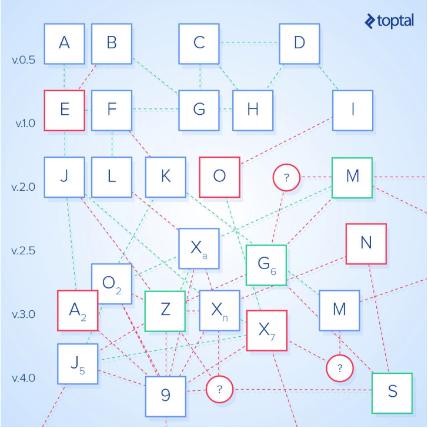
  > Many systems with high levels of entropy rely on specific individuals, particularly if there are junior members of the development team.
- Se a expectativa de vida do software é baixa, a probabilidade da entropia do software impactar negativamente alguma coisa é baixa
- Falta de conhecimento é uma das principais causas de entropia (uma pessoa saindo do time é conhecimento indo embora)
- Todo ciclo de desenvolvimento tem uma probabilidade de aumentar a entropia (nunca de diminuir)
- Se focarmos sempre em refatoracão, estaremos sempre mitigando os problemas causados pelo ciclo anterior
- Se focarmos em cultura (conhecimento!), diminuiremos a probabilidade dos próximos ciclos aumentarem a entropia

### [GEORGE! frase de efeito aqui] Cedo ou tarde, adicionar uma mudanca será mais caro que refazer o sistema inteiro

### Duas opcões: fazer ou fazer bem - quando usar cada uma

### Spoiler: sempre faca (o) bem!

Referência: _https://www.toptal.com/software/software-entropy-explained_

## 2.1. Redux, MVC, MVVM, BLoC, Facades (2h)

### Um balaio de arquitetura

Redux
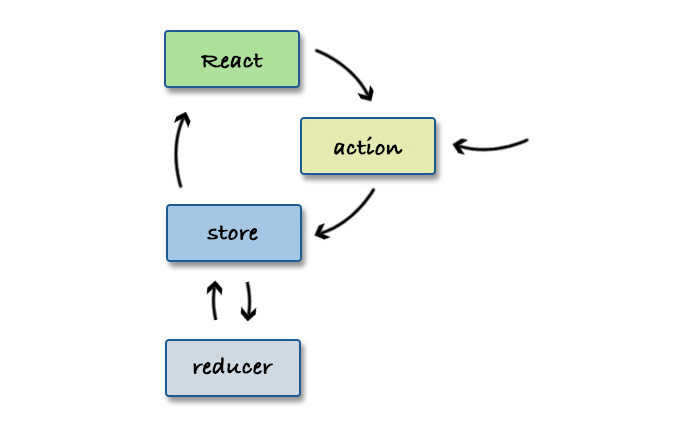
BLoC
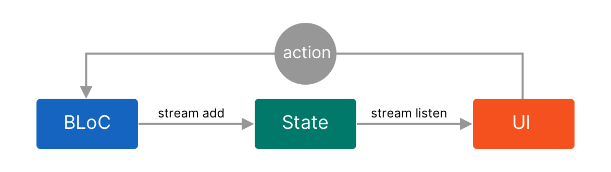
MVC

MVVM

Definicões:

> **MVC**:
> Model-View-Controller (MVC) é um padrão arquitetônico usado na engenharia de software em que o padrão isola a "lógica de domínio" (a lógica do aplicativo para o usuário) da interface do usuário (entrada e apresentação), permitindo o desenvolvimento independente, teste e manutenção de cada (separação de preocupações).

> **MVP**:
> Model-view-presenter (MVP) é uma derivada do padrão de software model-view-controller, usado principalmente para construir interfaces de usuário. No MVP, o apresentador assume a funcionalidade do "middle-man" (correspondendo ao controller de aplicação no MVC). Além disso, a view é responsável por manipular os eventos da UI (como mouse down, key down, etc.), que costumava ser o trabalho do controller. Eventualmente, o model se torna estritamente um modelo de domínio.

> **MVVM**:
> Model-View-ViewModel (MVVM) é um padrão de design arquitetônico para implementação de interfaces de usuário. Seu foco principal é a separação de preocupação entre a View (UI) e o Model (Dados) usando uma camada intermediária chamada ViewModel para melhorar a capacidade de gerenciamento, escalabilidade e testabilidade.

Referência: _@UzumakiArtanis https://pt.stackoverflow.com/a/212181_

### Um balaio de prós e contras, vantagens e desvantagens

### A arte de fazer o simples

### Todo sistema é simples até que se prove o contrário (sem inocência, por favor)

### Tudo que você complicar será usado contra você no futuro

### DRY e as abstracões prematuras

## 2.2. Composição vs Herança (45min)

### O que danado é composicão

### O que danado é Heranca

### E aí?

## 2.3. Async programming (30min)

### A vida é assíncrona, a web também

### Callbacks

### Callback hell

### JS, event loop, single threaded

## 2.4. Promises e Observables (1h30min)

### Promises - conceito

### Promises - utilizacão

### Promises - vantagens

### Promises - limitacões

### Observables - agora vai!

### Observables - tudo é stream! [CycleJS](https://cycle.js.org/)

### Observables - se for, vá na paz

### Observables - só o necessário

### Services com Observables

### Links: [RxJS best practices](https://blog.strongbrew.io/rxjs-best-practices-in-angular/), [docs](https://www.learnrxjs.io/),

## 2.5. Routing e Lazy Loading (1h)

### Routing - natural e necessário

### Routing - coisas que ajudam

### Lazy Loading - como seria a vida sem ele

### Lazy Loading - pontos de atencão

### AoT, Ivy

## 2.6. Tratamento de errors (45min)

### Desista, erro acontece

### É tudo uma questão de comunicacão

### Pense primeiro no que pode dar errado, mas não leve isso para sua vida =)

### View sempre preparada para erros

### Tratamento defaul e tratamento específico

## 2.7. Comunicação com a API (45min)

### É tudo uma questão de comunicacão!

### Status é tudo (não é, mas é)

### Servicos para nos ajudarem

### Models, models, models!

### Decode/encode pra organizar as coisas

## 2.8. Autenticação (45min)

### State, antes de mais nada

### LocalStorage/Cookies

### Processo padrão: storage -> self -> ok/not ok

### Interceptors

### [Tutorial](https://jasonwatmore.com/post/2019/06/22/angular-8-jwt-authentication-example-tutorial)

# 3. CRUD (4h)

### Danado é isso

### Data-driven applications

### Eu como isso no café da manhã

## 3.1. Listagem: paginação, filtros, ordenação, busca (1h30min)

### Não precisamos paginar, é só pegar tudo

### Filtrar todo mundo sabe, bora fazer direito (Query Models)

### UI <-> Query Model <-> URL -> HTTP request

### Ordenacão é tipo filtro

### Busca é tipo filtro

### Recursos de UI para facilitar pro usuário

## 3.2. Listagem avançada: lista infinita, virtual scroll (30min)

### Lista infinita - tem pra quê? Pergunta pro designer

### Virtual scroll - tem pra quê? TEM!

## 3.3. Forms avançados: seleção de entidade relacionada, seleção múltipla, forms embutidos, forms em modal na listagem (2h)

### Selecão - lazy ou não lazy? Tem espaco pra todo mundo

### Forms embutidos dependem do backend

### Transformando form em servico

### Injetando o form em tudo que lugar

# Extra

## Padroes de css

### Functional css

### Importância das variáveis globais de configuracão (tamanhos de fonte, espacamento, cores, tamanhos de borda, etc)

### SASS vs. CSS Variables

## Máscaras

## gráficos
